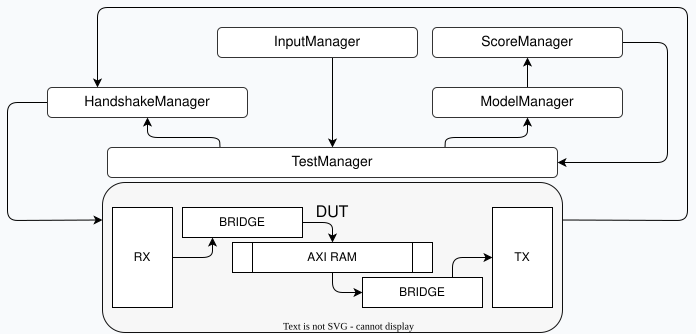

# UART-AXI Testbench Framework

## Project Overview

This project was originally a lab for my CSE 225 class at the University of California Santa Cruz, developed by Professor Dustin Richmond of the Computer Science and Engineering department.

The module accepts command packets over a UART RX stream, converts them into AXI-style memory transactions, and returns read data over UART TX. The current verification flow focuses on behavioral simulation of the UART command stream, aligned RAM readback, partial byte accesses, misaligned byte accesses, and mixed random RAM traffic.

The current scope is simulation-first verification of the UART-to-AXI datapath. However, FPGA board integration files are included under `syn/icebreaker`.

## Architecture

The design instantiates a UART debug bridge and an AXI RAM. The bridge decodes UART write and read packets, issues AXI memory accesses, and serializes read responses back over UART.



## Verification

The cocotb testbench is organized with small manager classes:

| Component | Purpose |
| --- | --- |
| `InputManager` | Feeds transaction streams into the environment. |
| `HandshakeManager` | Drives UART packets and receives UART responses. |
| `ModelManager` | Tracks expected RAM contents. |
| `ScoreManager` | Compares UART read responses against the model. |
| `TestManager` | Coordinates stimulus, model updates, and checking. |

The purpose of this project is to demonstrate a reusable OOP-based Python hardware verification framework developed across multiple personal projects. Current tests cover basic UART packet driving, AXI memory readback, reference modeling, scoreboarding, controlled aligned/partial/misaligned accesses, and mixed random traffic. This is a lightweight attempt to get UVM-like organization without the complexity of SystemVerilog class semantics.

## Project Structure

```text
uart-axi/
|---- rtl/
|   |---- uart_axi/
|       |---- uart_axi.sv
|       |---- uart_axi_test.py
|       |---- filelist.json
|       |---- Makefile
|
|---- submodules/
|   |---- imports/
|       |---- axi_ram.sv
|       |---- dbg_bridge.sv
|       |---- dbg_bridge_fifo.sv
|       |---- dbg_bridge_uart.sv
|
|---- syn/
|   |---- icebreaker/
|       |---- top.sv
|       |---- pll.sv
|       |---- icebreaker.pcf
|
|---- docs/
|   |---- uart_axi_testbench_architecture.svg
```
